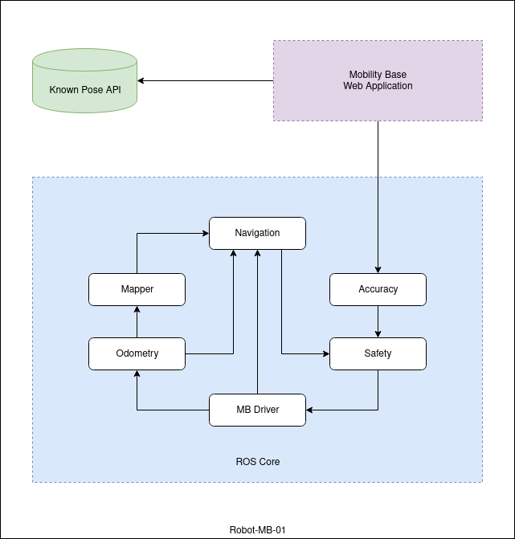
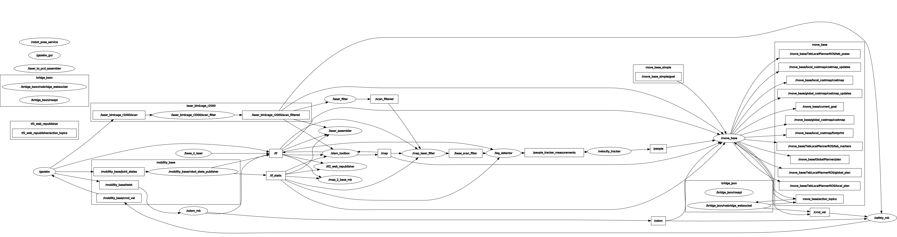
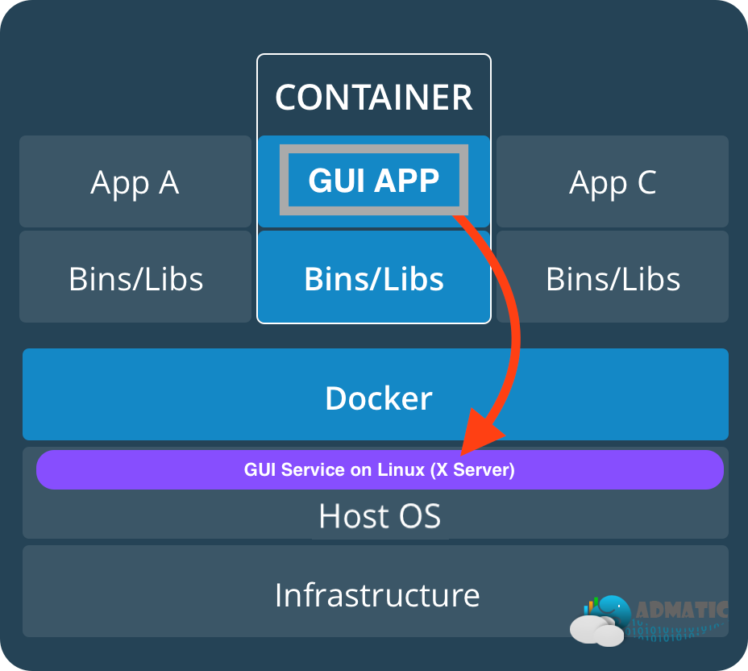

# Development Environment for Baxter's Mobility Base

<details>
  <summary>
    <strong>Table of Contents</strong>
    <small><i>(🔎 Click to expand)</i></small>
  </summary>

* [Features](#features)
* [Screenshot](#screenshot)
* [Pre-requisites](#dependencies)
* [Save Password for Private Registry](#save-password-for-private-registry)
* [Service Configurations](#service-configurations)

</details>

## Features

- Fast development environment setup using containers and compose files
- Complete `ROS Kinetic` environment for real or simulated environments with
  - lifelong `SLAM`<sup>[1](#1)</sup> for large areas (like warehouses, retail,
  etc.)
  - navigation
  - exploration
  - pose accuracy
  - Gazebo 8.0 simulator
- Known Pose API for storing and retrieving (accurate<sup>[2](#2)</sup>) poses
- Web Application and UI for interacting with the base
- Jupyter notebooks for rapid prototyping integrated with
  - Python2.7 and Python3.8
  - ROS Kinetic
  - OpenCV 4.1.0
  - Octave 4.4.1
  - RealSense cameras
- Compose files defining different configurations of services for launching different
  - algorithms for SLAM, planners, environments (in simulator), etc.
  - scenarios for navigation, exploration, etc.
  - network setups (SDN, Docker Swarm)
- Templates for creating new ROS nodes in C++11 and Python2.7


<a name="1">1</a>: SLAM: Simultaneous Localization and Mapping

<a name="2">2</a>: Accurate poses define 6D poses with high precision.
They can - in a later step - be used for final pose adjustment with
sub-centimeter positional and sub-degree orientational accuracy

## Screenshot


## Dependencies
<details><summary>Install the required dependencies</summary>
<p>

+ `docker` > 18.04 from https://docs.docker.com/install
+ `docker-compose` > 1.25 from https://docs.docker.com/compose/install/
+ `gpg` > 2.2.4 (depending on distro also called `gpg2`) from
  https://gnupg.org/download/index.html
+ `pass` > 1.7.3 from https://www.passwordstore.org/

</p>
</details>

## Save Password for Private Registry
<details><summary>Create a GPG Key, Password Store and Entry for a Private Docker Registry</summary>
<p>

### Create a GPG Key

Start the `gpg` key creation walkthrough

```zsh
gpg --full-gen-key
```

After choosing the algorithm, key size and filling out the information list the keys using

```zsh
gpg --list-secret-keys --keyid-format LONG [EMAIL]
```

### Create the Password Store

Using this information create the store using

```zsh
pass init [Key-ID]
```

#### Example

Using `robot-mb-01@dfki` as eMail adress

```zsh
mb@mb-nuc:~$ gpg --list-secret-keys --keyid-format LONG robot-mb-01@dfki
gpg: checking the trustdb
gpg: marginals needed: 3  completes needed: 1  trust model: pgp
gpg: depth: 0  valid:   1  signed:   0  trust: 0-, 0q, 0n, 0m, 0f, 1u
sec   rsa4096/113897C2C995C5BC 2019-10-04 [SC]
      F5356B02F4A2A61AEF3EA0D7113897C2C995C5BC
uid                 [ultimate] Robot MB <robot-mb-01@dfki>
ssb   rsa4096/3D23DE1CB380C6F6 2019-10-04 [E]
```
Using the Key-ID from output `113897C2C995C5BC`

```zsh
mb@mb-nuc:~$ pass init 113897C2C995C5BC
mkdir: created directory '/home/mb/.password-store/'
Password store initialized for 113897C2C995C5BC
```

## Install the Docker Credentials Helper

Install the docker-credential-helpers to link the `Docker` with the `pass` world. Just execute the following commands to install the as of 18.12.2019 current version v0.6.3.

```zsh
wget https://github.com/docker/docker-credential-helpers/releases/download/v0.6.3/docker-credential-pass-v0.6.3-amd64.tar.gz
tar -xf docker-credential-pass-v0.6.3-amd64.tar.gz
chmod +x docker-credential-pass
sudo mv docker-credential-pass /usr/local/bin/
```

### Creating an Entry for a Private Docker Registry

Now all that's left to do is login to the desired Docker registries using the usual `docker login` command. This will automagically save the credentials into the created store and encrypt it using the GPG key that is secured using our (hopefully strong) password.

In order to not expose our registry password on the CLI we can use following command to prompt for the password securely using

```zsh
docker login [URI:PORT]
```

#### Example for EnterpriseLab Registry

```
docker login repohub.enterpriselab.ch:5002
```

### (Maybe) Configure the Credentials Store

If above throws an error, try to specify the credential store in `$HOME/.docker/config.json` to tell the docker engine to use that specific store.

Just add the line `"credsStore": "pass"` to this JSON file after adding a comma
as seen below. There should already be an entry for the `User-Agent` in
`HttpHeaders`.

```json
{
	"HttpHeaders": {
		"User-Agent": "Docker-Client/19.03.4-ce (linux)"
	},
	"credsStore": "pass"
}
```
</p>
</details>

## Service Configurations





Clone the simulator compose files using

```zsh
git clone git@gitlab.enterpriselab.ch:mt-kawa/ros-kinetic-compose/ros-kinetic-mb-sim-compose.git
```

There are multiple compose files in that repository for different use cases.

1. For running in exploration mode and build an initial map there is
`dc-map-explore-web.yml`.
2. For running just the


## Allow X11 Forwarding for Docker

In order to enable using GUI applications natively with GPU support we have to 


